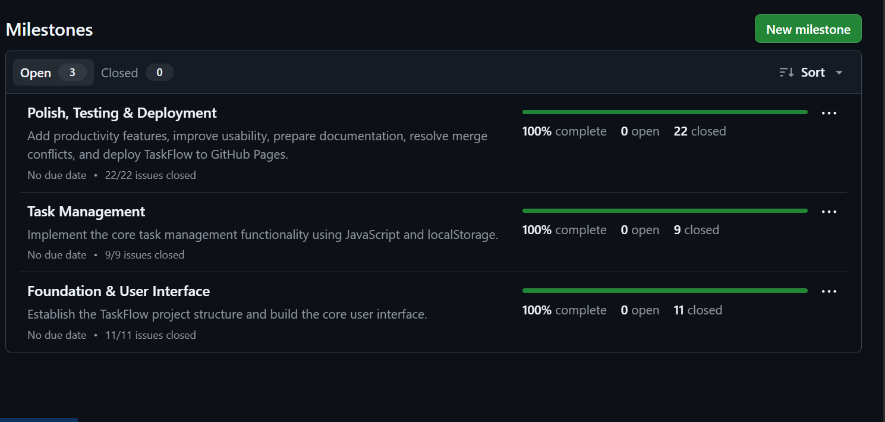
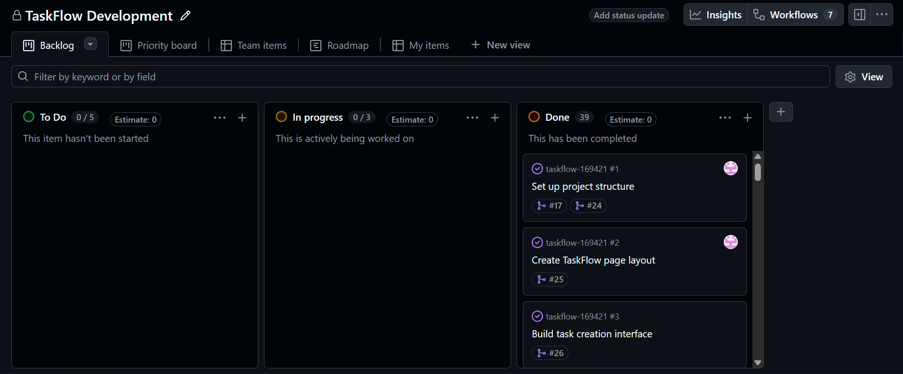
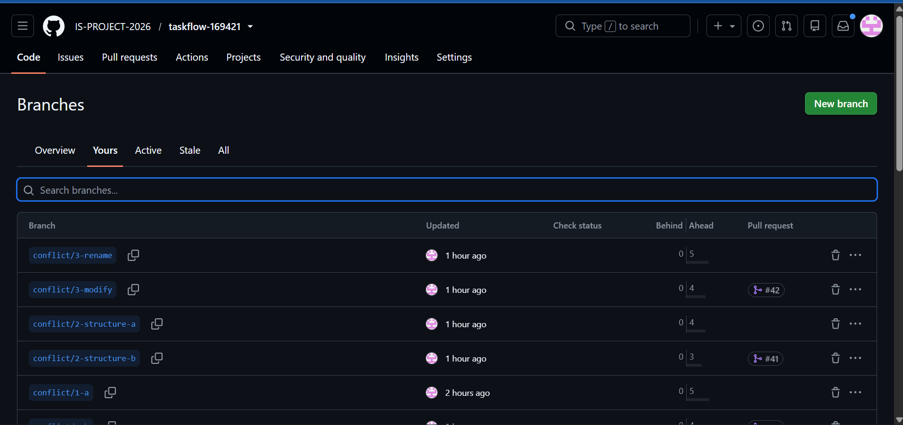
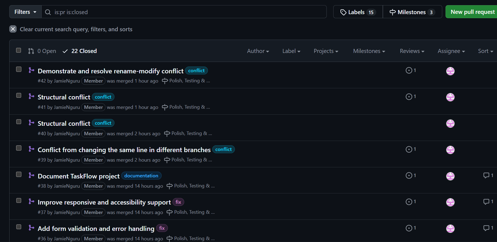
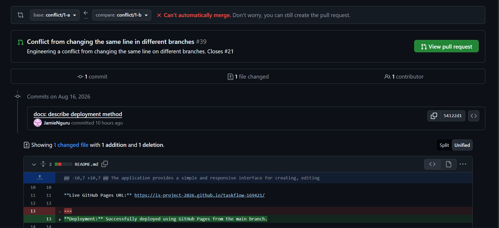
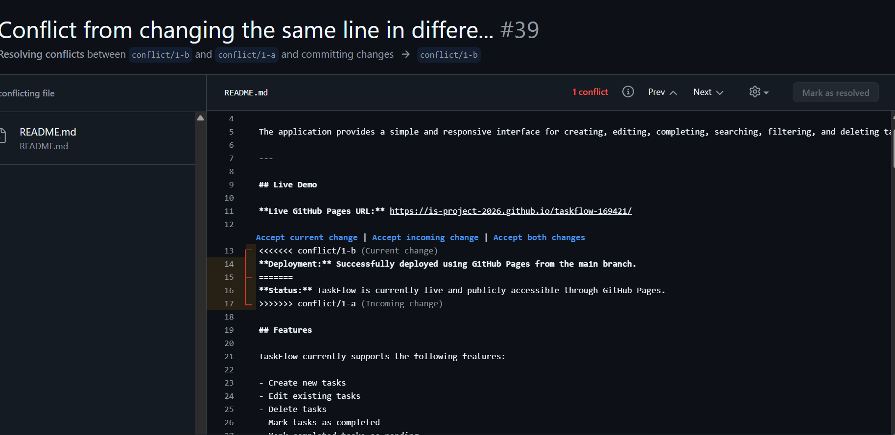
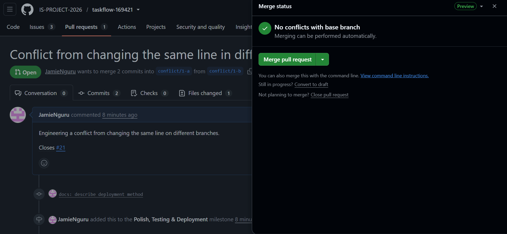
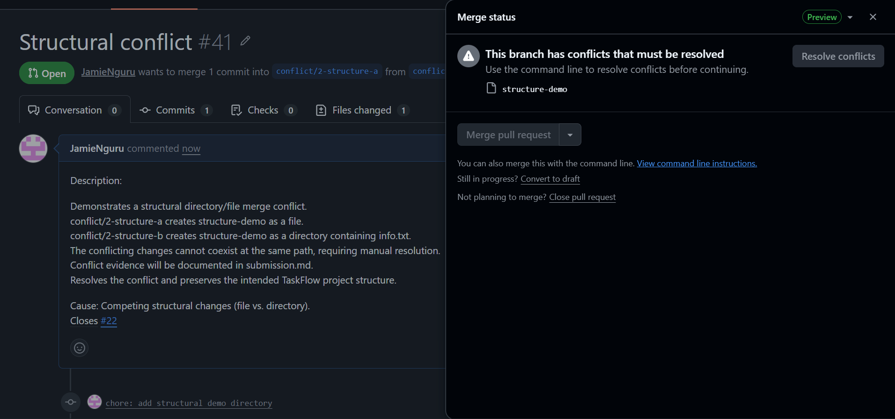
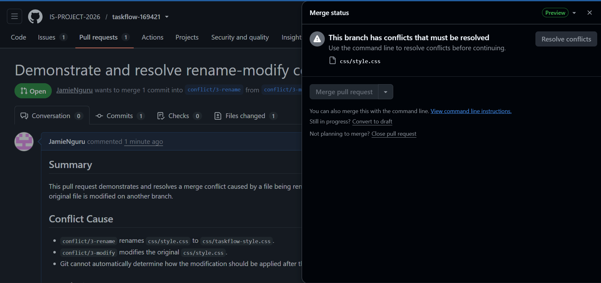

# Project Submission Report

## 1. Student Details

* **Full Name:** Jamie Nguru Kibanya
* **GitHub Username:** JamieNguru
* **Email:** jamie.kibanya@strathhmore.edu

---

## 2. Deployed Project Link

* **Live GitHub Pages URL:** https://is-project-2026.github.io/taskflow-169421/

---

## 3. Reflection — Grounded in Your Git History

> **Rules:** Every answer below must include a direct link to the specific commit, PR, issue, or branch in the repository that demonstrates what is being described. Answers without working links will not be graded.

### A. Your Best Commit

* **Commit URL:** https://github.com/IS-PROJECT-2026/taskflow-169421/commit/2bafcb702b2ed8717fab386450835c22b27de151
* **Why this one?**

  This commit demonstrates a clear conventional commit message with an appropriate type tag and a concise description of the change. It clearly communicates what was changed and keeps the Git history easy to understand.

### B. A Mistake or Struggle

* **Link to the evidence:** https://github.com/IS-PROJECT-2026/taskflow-169421/pull/42
* **What happened and how did you recover?**

  During development, I encountered a Git workflow issue while working with branches and merge conflicts. I recovered by checking the repository status, identifying the branch and merge state, resolving the conflicting changes, and completing the merge with a clean commit. This helped me understand the importance of checking Git's current state before attempting another merge or pull.

### C. A Pull Request You're Proud Of

* **PR URL:** https://github.com/IS-PROJECT-2026/taskflow-169421/pull/35
* **What did you check before merging?**

  I reviewed the changed files, checked that the implementation matched the linked issue, verified that the application remained functional, and confirmed that the changes were appropriate before merging the Pull Request.

### D. One Thing You Would Do Differently

* **What would you change?**

  If I restarted the project, I would establish a more consistent branch and Git workflow from the beginning, including clearer issue-linked branch names and more frequent pushes to the remote repository. This would make branch management, conflict creation, and project traceability easier to manage.

* **Link to the evidence of the original decision:** https://github.com/IS-PROJECT-2026/taskflow-169421/issues/1

---

## 4. Screenshots of Key GitHub Features

### A. Milestones and Issues

The screenshot below demonstrates the use of GitHub milestones and granular issues to divide the project into manageable development tasks.

**Screenshot:**

* **Caption:** GitHub milestones and issues showing the project's development tasks organized and tracked throughout the project.

### B. Project Board

The project board was used to track development progress by organizing issues according to their current status.

**Screenshot:**

* **Caption:** GitHub Project Board showing project issues organized across development stages such as To Do, In Progress, and Done.

### C. Branching Architecture

The project used separate branches for different features, fixes, documentation work, styling changes, and merge-conflict demonstrations.

**Screenshot:**

* **Caption:** Git branch list demonstrating the use of structured branch naming conventions such as `feat/`, `fix/`, `style/`, `docs/`, and `conflict/`.

### D. Pull Requests & Traceability

Pull Requests were used to review and merge completed development work while maintaining traceability between issues and code changes.

**Screenshot:**

* **Caption:** Pull Request showing the relationship between a development issue and the corresponding implementation and merge.

---

## 5. Merge Conflict Evidence

Three separate merge conflicts were deliberately engineered and resolved during development. Each conflict was triggered by a different cause.

---

### Conflict 1 — Full Chronology

**What cause did you use?**

Competing content changes.

Two branches contained different changes to the same content, causing Git to require manual resolution.

#### Step 1: Generating the Clash

**Screenshot:**

* **Caption:** The merge attempt between the two conflicting branches produced a Git conflict warning because both branches contained competing changes.

#### Step 2: Inside the Code Editor — Conflict Markers

**Screenshot:**

* **Caption:** The editor displayed Git's conflict markers, including `<<<<<<<`, `=======`, and `>>>>>>>`, showing the competing versions from the two branches. The conflicting sections were reviewed and the appropriate content was selected or combined before resolution.

#### Step 3: Resolution & Clean Merge

**Screenshot:**

* **Caption:** The conflicting changes were resolved manually, the conflict markers were removed, and the resolved branch was committed and merged successfully.

---

### Conflict 2 — Structural File/Directory Conflict

**What cause did you use?**

Competing structural changes involving a file and directory at the same path.

**Why does this cause trigger a conflict?**

One branch created `structure-demo` as a file while the other branch created `structure-demo` as a directory. Git cannot automatically maintain both a file and directory at the same path, so manual resolution was required.

**Screenshot:**

* **Caption:** Conflict 2 was created by competing structural changes to the same path. The conflict was resolved by deciding which final project structure should be retained.

---

### Conflict 3 — Rename/Modify Conflict

**What cause did you use?**

File rename versus modification.

**Why does this cause trigger a conflict?**

One branch renamed `css/style.css` to `css/taskflow-style.css`, while another branch modified the original `css/style.css`. Git could not automatically determine how the modification should be applied after the file was renamed, requiring manual resolution.

**Screenshot:**

* **Caption:** Conflict 3 demonstrates a rename/modify conflict involving the TaskFlow stylesheet. The conflict was manually resolved while retaining the appropriate final stylesheet structure.

---

## 6. Feedback & Evaluation

To help improve this course for future engineering cohorts, please take 2 minutes to fill out the anonymous feedback form. Your honest review helps shape how this program is taught next semester!

* **Anonymous Evaluation Form:** [Course & Instructor Evaluation](https://forms.gle/YLybnsyXXErKEg3s9)

---

## Final Submission

Once the repository is complete, submit the project through the official submission form.

The form will stop accepting responses after **Monday, August 17th, 2026**. No late submissions will be accepted.

> **Submission Form:** https://forms.gle/KrT4VxtFtkU3wtYu8
